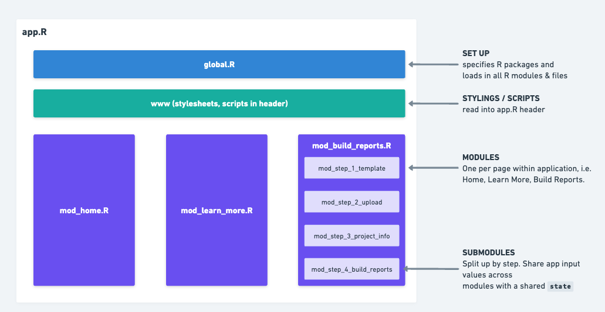
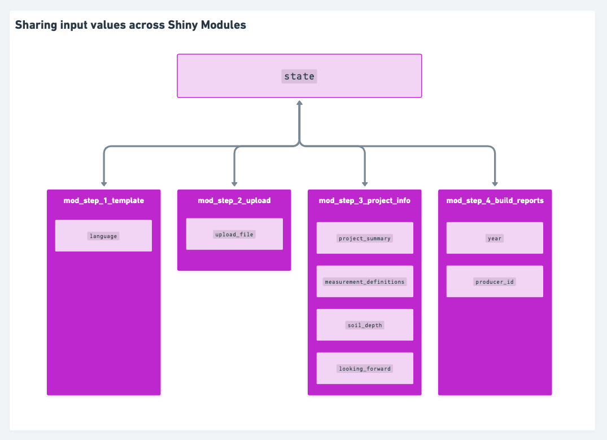
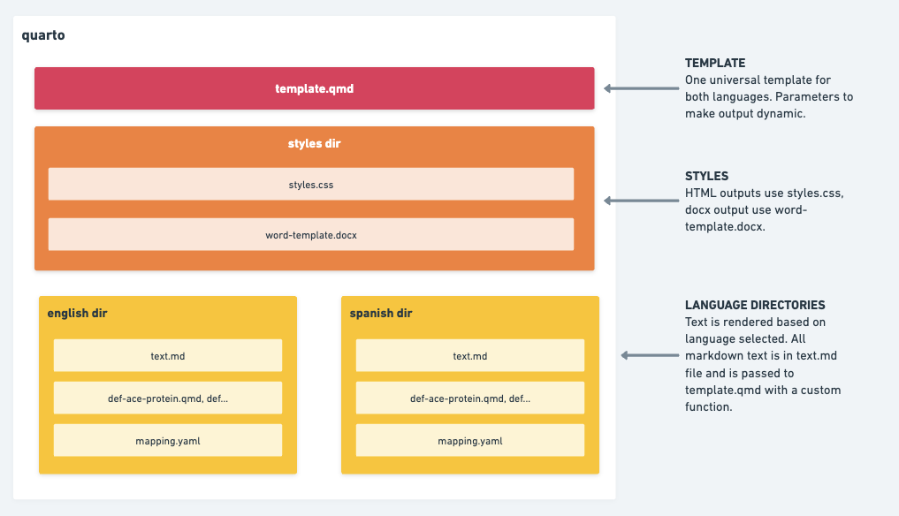

# Soil Health Reports

## About

The purpose of this Shiny application is to make soil health reports easily accessible by providing a no-code interface for users to upload and generate reports. The application works with the `soils` package to create a thorough analysis, including charts and tables to synthesize information about the user's crops. The main engine to create the reports is **`quarto`.** Users can select to generate reports in English or Spanish, and also have the option to download report formats in **html** or **docx**.

## Shiny Application Structure

This is a modular Shiny application. Working with modules will make it easier to maintain and scale code. The architecture is set up so that each page of the application is it's own module, e.g. Home page `mod_home.R`, Learn More is `mod_learn_more.R`, Build Reports is `mod_build_reports.R`.

The Build Reports page is broken down int 4 sub modules to match the steps in the user form. Since these modules rely on inputs from sibling modules, the values for these variables are shared in a global store value, `state`.

## Build Reports

The application is structured into four main steps, each managed by a separate module:

+------------------------------+--------------------------------------------------------------------------------------------------------------------------------------------------+
| Step                         | Description                                                                                                                                      |
+==============================+==================================================================================================================================================+
| **Download Template**        | \- Allows users to download an Excel template for data entry.                                                                                    |
|                              |                                                                                                                                                  |
| `mod_step_1_template.R`      | \- Provides language selection for the report (English or Spanish).                                                                              |
|                              |                                                                                                                                                  |
|                              | \- Offers information about the data template.                                                                                                   |
+------------------------------+--------------------------------------------------------------------------------------------------------------------------------------------------+
| **Upload Data**              | \- Enables users to upload their completed data template (.xlsx).                                                                                |
|                              |                                                                                                                                                  |
| `mod_step_2_upload.R`        | \- Validates the uploaded data against required fields and data integrity checks.                                                                |
|                              |                                                                                                                                                  |
|                              | \- Displays error messages for any validation failures, or a success message if all checks pass.                                                 |
|                              |                                                                                                                                                  |
|                              | \- Saves the uploaded data and data dictionary into a reactive value for use in subsequent steps."                                               |
+------------------------------+--------------------------------------------------------------------------------------------------------------------------------------------------+
| **Project Info**             | \- Collects project-specific information, including project name, summary, measurement definitions, soil depth, and a "Looking Forward" section. |
|                              |                                                                                                                                                  |
| `mod_step_3_project_info.R`  | \- Dynamically renders a measurement picker based on the selected language.                                                                      |
|                              |                                                                                                                                                  |
|                              | \- Provides a preview modal to review the entered information and selected measurement definitions. "                                            |
+------------------------------+--------------------------------------------------------------------------------------------------------------------------------------------------+
| **Build Reports**            | \- Offers options to generate reports in Word (.docx) and/or HTML formats.                                                                       |
|                              |                                                                                                                                                  |
| `mod_step_4_build_reports.R` | -   Generates and downloads a zip file containing the reports.                                                                                   |
+------------------------------+--------------------------------------------------------------------------------------------------------------------------------------------------+

## Quarto Template

These reports are based off of the templates provided by the `soils` package. To date, there are two templates to support different languages - English and Spanish. To help maintain the code, these templates were translated using a modular approach, whereby shared inputs are kept in one **template.qmd** file, and differences in language outputs are stored within specific directories (e.g. **english** and **spanish**).

### Language Translation

Translation for markdown text chunks is stored and maintained in each language directory's **`text.md`** file. This works in conjunction with a custom function in the quarto report called `get_text()`, that looks up a section and returns the markdown.

To help manage simple translations for variable names, each language directory also includes a **`mapping.yaml`** file with basic text lookups. This works with another custom function `tr()` - which helps translate simple column names with a key-value lookup.

Lastly, these directories also include a series of qmd files for measurement definitions. These are noted with the prefix "def-". All files should apply consistent naming conventions across language directories.

## Deployment / Hosting

The application is hosted on shinyapps.io.
