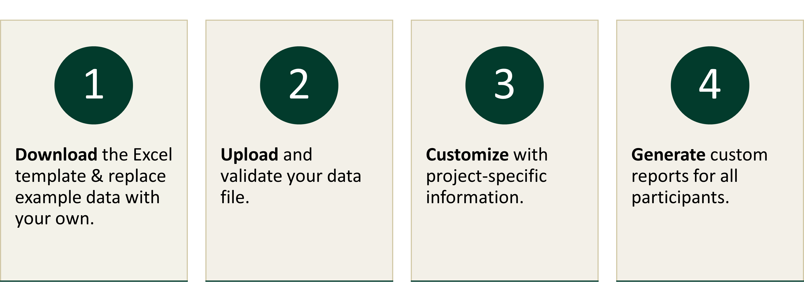

## What is this tool?

This interactive tool creates customized soil health reports for
participants in your soil sampling project. These reports distill the
latest soil health research and provide comparisons of each
participant’s samples with others from the same crop and county. The
goal is to make complex soils data more accessible and actionable,
empowering participants to better understand and manage soil health.

## How can it help me?

Generating customized and comprehensive soil health reports for numerous
participants can be complex, time-consuming, and require specialized
expertise in soil science and data automation. This tool simplifies this
process by offering a no-code solution to automatically create reports
and provides technical assistance providers with a valuable resource to
enhance soil health outreach and extension efforts within their
communities.

## How do I use it?

Customized soil health reports can be generated in four steps. Be
prepared to spend the most time on steps 1 and 2 as you adjust your data
to match the template format.

## **Why was this tool created**?

This tool was developed as part of the [Washington Soil Health
Initiative’s State of the Soils
Assessment](https://washingtonsoilhealthinitiative.com/state-of-the-soils/),
which analyzed over 1,100 samples and provided customized reports to
more than 400 participants. To make this process accessible to others,
this user-friendly, no-code Shiny app was developed. This app helps
users automate the creation of comprehensive soil health reports without
advanced programming skills.

## **Who developed it?**

Soil scientists at Washington State Department of Agriculture (WSDA) and
Washington State University synthesized the latest soil health research.
The WSDA Data Scientist automated the generation of reports with R and
Quarto via the [{soils} R
package](https://wa-department-of-agriculture.github.io/soils/). This
package was adapted into this no-code app by WSDA in collaboration with
IndieVisual LLC.

## **How will these reports help growers?**

-   Provide a high-level overview of soil health in agriculture

-   Synthesize the latest research on soil health indicators with short
    descriptions and graphics

-   Offer context for interpreting soil health indicators (e.g., more is
    better, less is better, optimal range)

-   Describe how to make the most of soil testing

-   Plot the sampled fields on a map

-   Visualize results in both table and plot formats

-   Compare the participant’s results to other samples from the same
    crop, region, and project

-   Provide the report in two formats:

    -   An interactive HTML file that can be opened in a computer
        browser

    -   A static Microsoft Word document that can be printed or viewed
        on a computer

## **How can I further customize these reports?**

This tool prioritizes user-friendliness by limiting content and branding
customization. Microsoft Word reports can be generated and then edited
manually to suit your specific needs, while HTML reports require direct
editing of the HTML code for more customization. If you have experience
with R and Quarto, you can use the [{soils} R
package](https://github.com/WA-Department-of-Agriculture/soils/) to
fully adapt the underlying code for maximum flexibility and
personalization.

## **What’s next?**

Future updates include expanding the types of comparisons a user can
make (e.g. between sample depths or experimental treatments). The team
also plans to collect user feedback to understand how these reports
influence soil health perceptions, knowledge, and management practices.

## **Where can I see the source code & provide feedback?**

To view the source code, explore the WSDA [GitHub
repository](https://github.com/WA-Department-of-Agriculture/soil-health-report-generator).
If you have a feature request or would like to report a bug, please
[submit an
issue](https://github.com/WA-Department-of-Agriculture/soil-health-report-generator/issues)
or contact Jadey Ryan at <jryan@agr.wa.gov>.

Your feedback is welcome as the team works on updates and new features.
You are encouraged to share your experience using the tool and how
recipients respond to these reports through this \[Google Form\].

## **Can I see examples of the reports?**

### Example HTML

Below is an example of an HTML output. You can also access it here on
this [site](https://soils-example-html.netlify.app/).

<iframe src="https://soils-example-html.netlify.app/" 
        width="100%" 
        height="500" 
        style="border: none;">
</iframe>

### Example Word

    <iframe src="https://drive.google.com/file/d/1VsRDa4zzzevCVYK17RvtbxHVu2nELCUc/preview" style="position: absolute; top: 0; left: 0; width: 100%; height: 100%; border: none;">
    </iframe>

